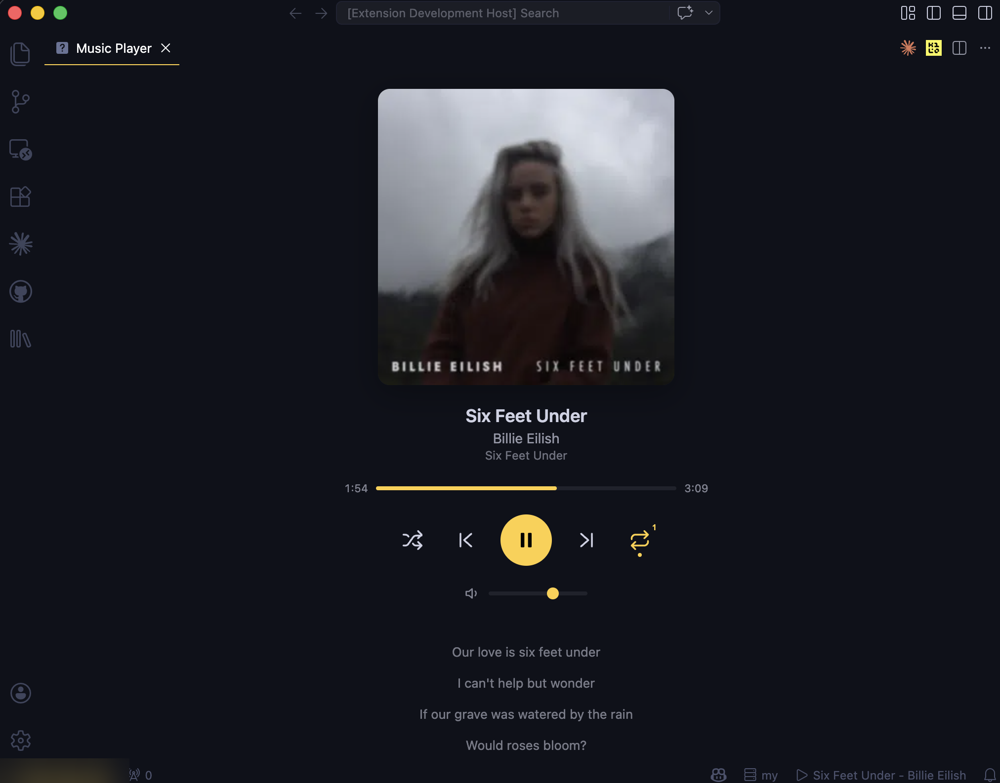
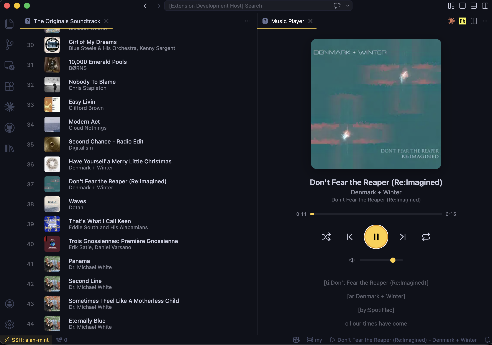

# Subsonic Player for VS Code

A music player extension for VS Code that connects to [Navidrome](https://www.navidrome.org/) and [Subsonic](http://www.subsonic.org/)-compatible servers.

## Screenshots

| Player with synced lyrics | Playlist detail view |
|:---:|:---:|
|  |  |

## Features

- **Library browsing** - Browse artists, albums, and songs from your server
- **Album details** - Open albums with artwork, metadata, track rows, and queue actions
- **Playlist support** - View and play playlists including Navidrome Smart Playlists (.nsp)
- **Favorites** - Star and unstar albums or tracks, with favorite songs in the Library view
- **Synced lyrics** - Display time-synced lyrics with click-to-seek
- **Playback controls** - Play, pause, next, previous, shuffle, repeat (all/one)
- **Now Playing** - See and favorite the active track from the Library view
- **Queue management** - Play next, add to queue, remove tracks, reorder queue items
- **Search** - Search across artists, albums, and songs
- **Multi-server** - Add and switch between multiple Navidrome/Subsonic servers
- **Secure credentials** - Passwords stored in VS Code's encrypted SecretStorage
- **Keyboard shortcuts** - `Ctrl+Alt+P` play/pause, `Ctrl+Alt+Right/Left` next/previous

## Getting Started

1. Install the extension
2. Open the Command Palette (`Ctrl+Shift+P`) and run **Subsonic Player: Add Server**
3. Enter your server URL, username, and password
4. Browse your library from the **Music** icon in the Activity Bar

## Commands

| Command | Description |
|---------|-------------|
| `Subsonic Player: Add Server` | Add a new Navidrome/Subsonic server |
| `Subsonic Player: Switch Server` | Switch between configured servers |
| `Subsonic Player: Remove Server` | Remove a server |
| `Subsonic Player: Open Music Player` | Open the player panel |
| `Subsonic Player: Play / Pause` | Toggle playback |
| `Subsonic Player: Next Track` | Skip to next track |
| `Subsonic Player: Previous Track` | Go to previous track |
| `Subsonic Player: Search Library` | Search songs and albums |
| `Subsonic Player: Play Random Songs` | Start a random-song queue |
| `Subsonic Player: Refresh Library` | Refresh library and playlist views |
| `Subsonic Player: Clear Queue` | Remove all queued tracks |

Click albums to open their detail view. Open playlists for per-track play-next, add-to-queue, and favorite buttons. Right-click albums, songs, playlists, playlist tracks, now-playing tracks, or queue items for contextual playback, queue, and favorite actions.

## Keyboard Shortcuts

| Shortcut | Action |
|----------|--------|
| `Ctrl+Alt+P` (`Cmd+Alt+P` on Mac) | Play / Pause |
| `Ctrl+Alt+Right` (`Cmd+Alt+Right` on Mac) | Next Track |
| `Ctrl+Alt+Left` (`Cmd+Alt+Left` on Mac) | Previous Track |

## Server Compatibility

- [Navidrome](https://www.navidrome.org/) (recommended, full support including smart playlists)
- Any server implementing the [Subsonic API](http://www.subsonic.org/pages/api.jsp) v1.16.1+

## License

[MIT](LICENSE)
